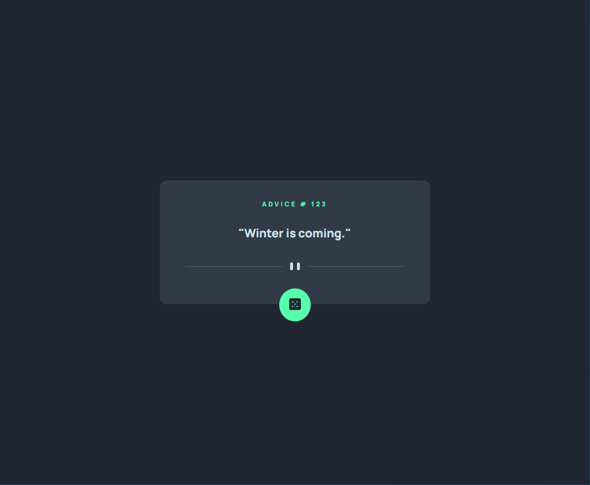

# Frontend Mentor - Advice generator app solution

This is a solution to the [Advice generator app challenge on Frontend Mentor](https://www.frontendmentor.io/challenges/advice-generator-app-QdUG-13db). Frontend Mentor challenges help you improve your coding skills by building realistic projects.

## Table of contents

- [Overview](#overview)
  - [The challenge](#the-challenge)
  - [Screenshot](#screenshot)
  - [Links](#links)
- [My process](#my-process)
  - [Built with](#built-with)
  - [What I learned](#what-i-learned)
  - [Useful resources](#useful-resources)
- [Author](#author)

## Overview

### The challenge

Users should be able to:

- View the optimal layout for the app depending on their device's screen size
- See hover states for all interactive elements on the page
- Generate a new piece of advice by clicking the dice icon

### Screenshot

### Links

- Solution URL: https://github.com/anankaaa/Advice-Generator-App
- Live Site URL: https://anankaaa.github.io/Advice-Generator-App/

## My process

### Built with

- Semantic HTML5 markup
- CSS custom properties
- Flexbox
- Mobile-first workflow
- Async-await development

### What I learned

In this exercise I have practised to use flexbox and asyncronous call development.

### Useful resources

- https://developer.mozilla.org/en-US/docs/Web/JavaScript/Reference/Statements/async_function - This helped me to use async - await. I really liked this pattern and will use it going forward.
- https://www.linkedin.com/pulse/asyncawait-vs-promises-abdul-rasheed/ - This is a useful article which helped me finally understand difference between async-await and Promises. I'd recommend it to anyone still learning this concept.

## Author

- Frontend Mentor - [@anankaaa](https://www.frontendmentor.io/profile/anankaaa)
